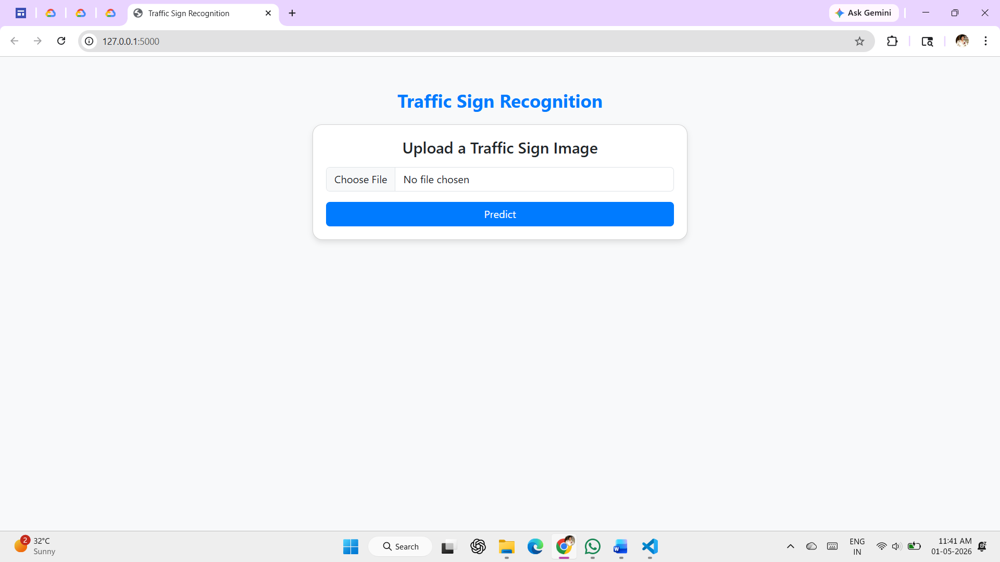

# 🚦 Traffic Sign Recognition System


---

## 📌 Overview

This is a **Traffic Sign Recognition System** built using **Convolutional Neural Networks (CNN)** and **OpenCV**.  
The system allows users to upload an image of a traffic sign and predicts its class using a trained deep learning model via a **Flask web interface**.

---

## 📌 Features

- ✅ Real-time Image Upload  
- ✅ CNN-based Multi-class Classification  
- ✅ Flask Web Interface  
- ✅ OpenCV Image Preprocessing  
- ✅ Fast & Accurate Predictions  

---

## 📷 Output Screenshots

### 🔹 Input Image


### 🔹 Prediction Output


---

## 📊 Demo

| Input | Prediction |
|------|-----------|
|  |  |

---

## 📈 Model Performance

- 🎯 **Accuracy:** ~95% (depending on dataset)  
- 📉 **Loss:** Low training & validation loss  
- ⚡ **Inference Time:** Fast (real-time prediction)  

---

## ⚙️ Tech Stack

- 🔹 **Programming Language:** Python 3.8+  
- 🔹 **Deep Learning:** TensorFlow / Keras (CNN)  
- 🔹 **Backend:** Flask  
- 🔹 **Image Processing:** OpenCV  
- 🔹 **Frontend:** HTML, CSS, Bootstrap 5  
- 🔹 **Libraries:** NumPy, Pandas, Scikit-learn  

---

## 🚀 Installation & Setup

### 🔹 1. Create Virtual Environment
```bash
python -m venv venv
```

### 🔹 2. Activate Environment

**Windows**
```bash
venv\Scripts\activate
```

**Mac/Linux**
```bash
source venv/bin/activate
```

### 🔹 3. Install Dependencies
```bash
pip install -r requirements.txt
```

### 🔹 4. Train Model
```bash
python model/train_model.py
```

### 🔹 5. Run Application
```bash
python app.py
```

### 🔹 6. Open Browser
```bash
http://127.0.0.1:5000/
```

---

## 📂 Dataset

The dataset is included in this repository.

Structure:
- `dataset/Indian-Traffic-Sign-Dataset/Images/`
- Contains folders **0 to 58**, each representing a traffic sign class.

Each folder contains images of that specific traffic sign category.

---

## 📁 Project Structure

```
Traffic_Sign_Recognition/
│── app.py
│── requirements.txt
│── README.md
│── .gitignore
│── dataset/
│   └── Indian-Traffic-Sign-Dataset/
│       ├── Images/
│       │   ├── 0/
│       │   ├── 1/
│       │   ├── ...
│       │   └── 58/
│       └── traffic_sign.csv
│── model/
│   ├── train_model.py
│   └── traffic_sign_model.h5
│── static/
│   └── screenshots/
│       ├── input.png
│       └── output.png
│── uploads/
│── templates/
│   └── index.html
```

---

## 🤝 Contributing

Contributions are welcome! Feel free to fork and improve the project.

---

## ⚠️ License

This project is open-source and free to use.

---

## 👨‍💻 Author

**Mrunal Fattepurkar** 

---
